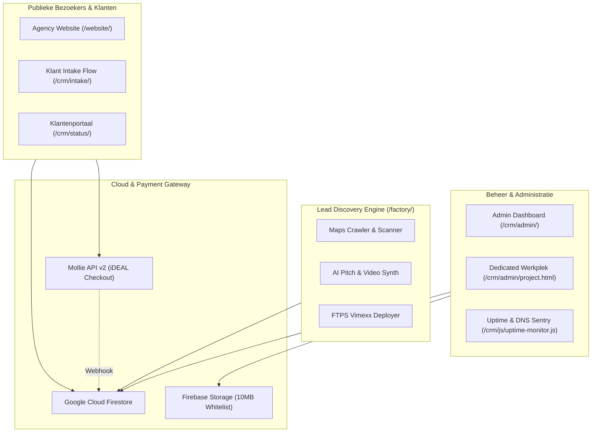

# Creation+Alt+Fix: Autonomous Agency & SaaS CRM Platform

[](#geautomatiseerde-testen--kwaliteitsborging)
[](#technische-stack)
[](#cloud-infrastructuur)
[](#beveiliging--compliance)
[](#commerciele-overdracht--licentie)

> **All-in-one softwareplatform voor digitale bureaus en webontwikkelaars:** Bevat een razendsnelle, tweetalige agency-website, een multi-tenant klantenportaal met digitale offertes en Mollie iDEAL facturatie, een geavanceerd admin-werkstation met 24/7 uptime monitoring, en een autonome lead discovery engine.

---

## Inhoudsopgave

1. [Systeemarchitectuur & Modulen](#systeemarchitectuur--modulen)
2. [Belangrijkste Functionaliteiten](#belangrijkste-functionaliteiten)
3. [Technische Stack](#technische-stack)
4. [Mappenstructuur](#mappenstructuur)
5. [Installatie & Lokale Ontwikkeling](#installatie--lokale-ontwikkeling)
6. [Beveiliging & Compliance](#beveiliging--compliance)
7. [Geautomatiseerde Testen & Kwaliteitsborging](#geautomatiseerde-testen--kwaliteitsborging)
8. [Commercial Packaging & Release Pipeline](#commercial-packaging--release-pipeline)
9. [Productie Deployment](#productie-deployment)

---

## Systeemarchitectuur & Modulen

Het platform combineert een ultra-lichtgewicht, framework-onafhankelijke frontend met een schaalbare Cloud BaaS (Firebase) en geharde PHP microservices:



---

## Belangrijkste Functionaliteiten

### 1. Agency Website (`/website/`)
- **Zero-Build Vanilla ES Modules:** Geen zware build-steps (geen Webpack of Vite benodigd). Directe native browser execution met sub-seconde laadtijden.
- **100% WebP Asset Pipeline:** Afslankt van 31 MB naar ~2 MB voor maximale PageSpeed scores (95+ op mobile en desktop).
- **Volledige Tweetaligheid (NL/EN):** Gecentraliseerd vertaalwoordenboek (`translations-data.js`) met 750 unieke sleutels en instant taalwissel.

### 2. Klantenportaal (`/crm/status/`)
- **5-Fasen Voortgangstracker:** Live visualisatie van projectfasen (Intake $\rightarrow$ Offerte $\rightarrow$ Design $\rightarrow$ Ontwikkeling $\rightarrow$ Livegang).
- **Digitaal Akkoord & Handtekening:** Klanten accorderen offertes en SLA-contracten direct in de browser met cryptografische audit logging.
- **Multi-Facturatie & Mollie iDEAL:** Directe betaling via veilige single-use betaallinks, inclusief automatische status-terugkoppeling en PDF-downloads.
- **Staging Viewer & Bestandsbeheer:** Veilig previewen van conceptwebsites en downloaden van opgeleverde projectbestanden.

### 3. Dedicated Admin Werkplek (`/crm/admin/project.html`)
- **All-in-one Projectbeheer:** Volledig overzicht van klantspecificaties, interne notities, milestones en communicatie.
- **Facturen Suite:** Slimme auto-increment factuurnummers, template presets (aanbetaling, hosting, APK), BTW-calculatie en 1-klik Mollie-link generatie.
- **Klantview Preview Engine:** Real-time inspectie van exact wat de klant in het portaal ziet, inclusief live responsive weergave.
- **Uptime Monitoring & Alerting:** Automatische DNS- en HTTP(S)-controles met alerts naar WhatsApp, Discord en Telegram.

### 4. Autonome Lead Discovery Factory (`/factory/`)
- **Geautomatiseerde Marktscan:** Doeltreffende discovery van regionale ondernemingen zonder website of met verouderde mobiele ervaring.
- **Concept Generatie & DRM Beveiliging:** Directe generatie van live conceptwebsites voorzien van domein-lock killswitch en Auteurswet 1912 bescherming.
- **FTPS Deployer:** Directe veilige upload naar Vimexx DirectAdmin servers.

### 5. 20-Punten Kwaliteitskeurmerk & Oplevergarantie
- **Intrinsieke Compliance by Design:** Alle websites voldoen direct bij creatie aan alle 20 criteria uit het [Kwaliteits- en Auditdossier](docs/20-PUNTEN-KWALITEITSKEURMERK-COMMERCIEEL.md).
- **Juridisch & AVG Waterdicht:** Ingebouwde Privacy Policy modal, Algemene Voorwaarden modal en zero-tracking cookiebanner. Voorkomt AVG-boetes tot € 20.000,-.
- **Google SEO & Rich Snippets:** Schema.org `@graph` met `LocalBusiness` en sector-specifieke `FAQPage` snippets voor directe uitklapbare vraag-en-antwoord weergave in Google.
- **Spam-Vrij & Conversie-Gedreven:** Verborgen honeypot spamfilter (`_hp_trap`), formuliervalidatie en directe 1-klik WhatsApp dispatch.
- **Superieure Snelheid:** Zuivere Vanilla code (< 50 KB, geen trage WordPress plugins), Lighthouse 95+ en volledige WCAG-toegankelijkheid.

---

## Technische Stack

| Component | Technologie | Eigenschappen |
| :--- | :--- | :--- |
| **Frontend** | Semantic HTML5, CSS3 Tokens, Vanilla JavaScript | Zero runtime build dependencies, Glassmorphism UI tokens |
| **Cloud BaaS** | Google Cloud Firestore & Firebase Auth | NoSQL document datastore, strict role-based security rules |
| **Bestandsopslag**| Firebase Storage | 10 MB per-bestand limiet, MIME whitelist, Firestore ownership checks |
| **Microservices** | PHP 8.x (`/crm/api/`) | Mollie Webhook listener met `flock`, ID token validatie, SSRF DNS pinning |
| **Lead Factory**  | Node.js 20+, Basic-FTP, Playwright | Autonome Maps crawler, data verrijking, video template synth |
| **Kwaliteitsborging**| Node.js Native Test Runner (`assert`) | 85 geautomatiseerde unittests over 14 suites, zero external dependencies |

---

## Mappenstructuur

```text
Creation-Alt-Fix/
├── crm/                         # Complete SaaS CRM & Klantenportaal Suite
│   ├── admin/                   # Dashboard overzicht & Dedicated Werkplek
│   │   ├── css/                 # Admin layout & design token stylesheets
│   │   ├── js/                  # Admin controllers & ES modules (Kanban, Stats, Billing)
│   │   └── project.html         # Dedicated Werkplek voor projectmanagement
│   ├── api/                     # Geharde PHP endpoints (Mollie checkout, webhooks, healthcheck)
│   ├── js/                      # Core runtime modules (Firebase, Auth, PDF generator, Uptime Sentry)
│   ├── status/                  # Responsive Klantenportaal (Fasen, Offerte, Facturen, SLA)
│   └── intake/                  # Interactieve klant intake vragenlijst
├── factory/                     # Autonome Lead Discovery & Concept Generator
│   ├── config/                  # Regio- en sectorconfiguraties
│   ├── deployer/                # Beveiligde Vimexx FTPS deployer
│   ├── discovery/               # Bedrijvenscanner & Google Maps crawler
│   ├── generator/               # AI Concept Generator & Pitch Builder
│   └── security/                # Domain-locking killswitch & DRM injectie
├── website/                     # Klantgerichte showcase & agency website
│   ├── css/                     # Modulaire CSS stylesheets
│   ├── js/                      # Website controllers & gedeelde vertaaldata
│   │   └── modules/             # Gecentraliseerd tweetalig woordenboek (750 keys)
│   └── images/                  # Geoptimaliseerde WebP afbeeldingsassets
├── docs/                        # Architectuur-, audit- en compliance documentatie
│   ├── CRM-SECURITY-AUDIT-DOSSIER.md # Technische audit specificatie (OWASP / ISO 27001)
│   └── startup-bible/           # Ondernemingsplan, financieel model en WBSO documenten
├── scripts/                     # Beheer-, packaging- en release-automatisering
│   └── package-release.mjs      # 1-klik distributie packager
├── tests/                       # CI/CD Quality Gate testsuite
│   └── run-all-tests.js         # 84 geautomatiseerde unittests
├── firestore.rules              # Granulaire Firestore NoSQL beveiligingsregels
├── storage.rules                # Firebase Storage validatie- en quotaregels
├── package.json                 # Projectconfiguratie & NPM scripts
└── README.md                    # Dit document
```

---

## Installatie & Lokale Ontwikkeling

### Vereisten
- **Node.js**: v18 of hoger (Node.js 20+ aanbevolen)
- **Webserver**: Lokale PHP server (bijv. PHP built-in server, XAMPP of Apache) of static server (zoals `npx serve`)

### 1. Repository klonen & dependencies installeren
```bash
git clone https://github.com/creationaltfix/creation-alt-fix.git
cd creation-alt-fix
npm install
```

### 2. Omgevingsvariabelen configureren
Kopieer het voorbeeldbestand en vul je gewenste sleutels in:
```bash
cp .env.example .env
```

### 3. Testsuite uitvoeren
Valideer de volledige codebase met één commando:
```bash
npm test
```
*Verwachte uitvoer:* `84 PASSED, 0 FAILED`.

### 4. Lokale server starten
```bash
# Start een lokale PHP ontwikkelserver voor het CRM:
php -S localhost:8000 -t crm/
```
Open vervolgens in je browser:
- **Admin Dashboard**: `http://localhost:8000/admin/`
- **Klantenportaal**: `http://localhost:8000/status/`
- **Intake**: `http://localhost:8000/intake/`

---

## Beveiliging & Compliance

De codebase is ontworpen conform zero-trust principes en gehard tegen de OWASP Top 10:

1. **Database Beveiliging (`firestore.rules`):**
   - Veld-whitelisting via `affectedKeys()`. Publieke gebruikers kunnen uitsluitend vooraf gedefinieerde velden invullen.
   - Prijzen en betaalstatussen (`proposalPrice`, `isPaid`) kunnen uitsluitend gemuteerd worden door geauthenticeerde beheerders of de beveiligde Mollie webhook.
2. **Opslag Beveiliging (`storage.rules`):**
   - Strikte 10 MB per-bestand uploadlimiet.
   - MIME-type whitelisting (PDF, JPG, PNG, WEBP, ZIP).
   - Cross-service verificatie: gebruikers kunnen uitsluitend bestanden uploaden naar projecten waarvan zij in Firestore als eigenaar geregistreerd staan.
3. **Webserver Hardening (`.htaccess`):**
   - Strict Content Security Policy (CSP) zonder onveilige wildcards.
   - HTTP Strict Transport Security (HSTS) met 1-jaar preload.
   - Directe blokkade van verborgen bestanden (`.env`, `.git`) en gevoelige extensies (`.sql`, `.log`, `.token`).
4. **SSRF Mitigaties (`healthcheck.php`):**
   - DNS Pinning en IP-validatie. Loopback ranges (`127.0.0.0/8`), private netwerken (`10.0.0.0/8`, `192.168.0.0/16`) en RFC 6598 Tailscale ranges (`100.64.0.0/10`) worden onverbiddelijk geweigerd.

---

## Geautomatiseerde Testen & Kwaliteitsborging

Het platform beschikt over een zero-dependency testsuite in `tests/run-all-tests.js`:

```bash
npm test
```

### Overzicht van de 13 Testsuites:
- **Suite 1:** Core Configuratie & XSS / URL Sanitizers
- **Suite 2:** Dashboard Statistieken & KPI Aggregatie
- **Suite 3:** Tabel Sortering & Datum Parsing
- **Suite 4:** Boekhouding & Abonnement Aanbevelingen
- **Suite 5:** Uptime Monitoring Sentry Engine
- **Suite 6:** Syntax Validatie over alle 33 JavaScript modules (`node --check`)
- **Suite 7:** Firebase Security Rules & Admin Whitelist Sync
- **Suite 8:** Domein Normalisatie & Deduplicatie
- **Suite 9:** Code Sanitization & White-Label Leak Audit
- **Suite 10:** Admin Klantview Preview Engine
- **Suite 11:** Applicatieve Beveiliging & Threat Defenses (CSV injectie, Storage rules, SSRF)
- **Suite 12:** Reactieve State, SLA Signing & Webhook Alerting
- **Suite 13:** Autonome Lead Discovery & Concept Factory

---

## Commercial Packaging & Release Pipeline

Wil je de software verpakken voor verkoop, overdracht of een audit door een externe partij?
Gebruik het geautomatiseerde release script:

```bash
npm run package
```

Dit script voert automatisch het volgende uit:
1. **Draait de testsuite:** De export breekt direct af als er ook maar 1 test faalt.
2. **Sanitizet privégegevens:** Sluit `.git`, lokale caches, `.env` wachtwoorden, en credentials uit.
3. **Genereert een Release Manifest:** Bevat checksums, bestandstelling en auditverificatie in `release/creation-alt-fix-v2.0.0/RELEASE-MANIFEST.json`.

---

## Productie Deployment

### Firebase Hosting & Rules
```bash
firebase deploy --only firestore:rules,storage:rules
```

### Vimexx / Apache / Nginx Deployment
1. Upload de inhoud van `/crm` naar je webroot (bijv. `portal.jouwdomein.nl`).
2. Upload de inhoud van `/website` naar je hoofddomein (bijv. `www.jouwdomein.nl`).
3. Zorg dat `mod_rewrite` en `mod_headers` actief zijn op Apache.
4. Configureer de productie `.env` met je eigen database- en API-sleutels.

---

## Commerciële Overdracht & Licentie

© 2026 Creation+Alt+Fix. Alle rechten voorbehouden.  
Dit platform is eigendom van Creation+Alt+Fix en beschikbaar voor zakelijke overname en commercieel gebruik conform overdrachtsovereenkomst.
