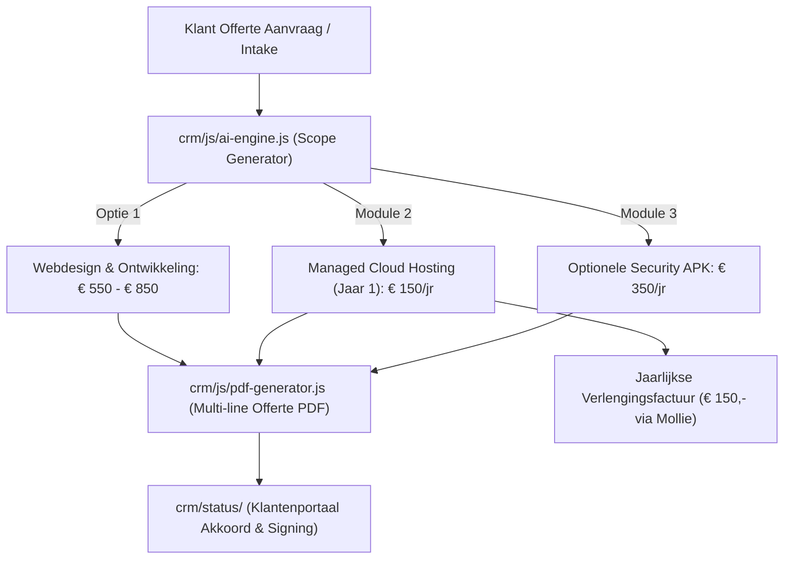

# Adviesdocument: Formalisering Vaste Hosting-, Domein- & APK-tarieven (TASK-816)

**Auteur:** Antigravity AI (Pair Programmer)  
**Datum:** 27 augustus 2026  
**Opdrachtgever:** Creation+Alt+Fix (Allard Veldman)  
**Scope:** `website/diensten/website-laten-maken/`, `crm/js/ai-engine.js`, `crm/js/pdf-generator.js`, `crm/admin/`  
**Status:** Definitief Advies & Uitvoeringsplan  

---

## 1. Executive Summary & Aanleiding

Creation+Alt+Fix levert hoogwaardige webontwikkeling, software-oplossingen en AI-automatiseringen. Waar de eenmalige ontwikkelprojecten helder zijn geprijsd, werden hosting, domeinregistraties en periodiek technisch beheer in het verleden ad-hoc of tegen kostprijs/onder de kostprijs doorberekend aan klanten.

Op basis van een grondige analyse van de inkomende en uitgaande facturen uit `C:\Users\Admin\Backups\Pi-Boekhouding` (database `boekhouding.db`, periode maart – juli 2026) blijkt dat:
1. **Inkoopkosten reëel en stijgend zijn:** Vimexx Webhosting Compleet kostte in juli 2026 **€ 109,23 excl. BTW (€ 132,17 incl. BTW)** per jaar; losse `.nl` domeinen kosten **€ 6,82 excl. BTW** en `.com` domeinen **€ 24,24 excl. BTW**.
2. **Historische verkoop margeloos was:** Facturen uit mei/juni 2026 rekenden voor hosting slechts **€ 1,00/maand (€ 12,-/jaar)** of **€ 5,00/maand (€ 60,-/jaar)**, inclusief domeinnaam voor € 10,-. Dit liet **geen ruimte** voor serverbeheer, SSL-onderhoud, SPF/DMARC anti-spoofing configuratie, updates of storingsopvolging.
3. **Kansen voor structurele ARR (Annual Recurring Revenue):** Door een vaste, professionele all-in tariefstructuur van **€ 150,- excl. BTW per jaar** voor *Managed Cloud Hosting & Domein* te hanteren en een optionele *Jaarlijkse Website & Security APK* van **€ 350,- tot € 495,- per jaar** aan te bieden, creëert Creation+Alt+Fix voorspelbare terugkerende omzet en maximale ontzorging voor de klant.

---

## 2. Financiële Analyse uit Pi-Boekhouding

De analyse van `Pi-Boekhouding\2026-08-27_21-00\boekhouding.db` toont de exacte historische inkoop- en verkooptransacties.

### 2.1 Inkoopfacturen (Leverancier: VIMEXX B.V.)

| Factuur / Referentie | Datum | Omschrijving / Item | Inkoopbedrag (excl. BTW) | Btw (21%) | Totaal Inkoop |
| :--- | :--- | :--- | :--- | :--- | :--- |
| **20262530372** | 25-03-2026 | Domein verlengen: `pomppop.nl` | € 6,82 | € 1,43 | € 8,25 |
| **20262547360** | 09-04-2026 | Domein verlengen: `capybaraculture.com` | € 24,24 | € 5,09 | € 29,33 |
| **20262580294** | 08-05-2026 | Domein verlengen: `angelastenekes.nl` | € 6,82 | € 1,43 | € 8,25 |
| **20262580295** | 08-05-2026 | Domein verlengen: `pomppop.nl` | € 6,82 | € 1,43 | € 8,25 |
| **INK-2026-001** | 27-05-2026 | Domein Scholte Elektrotechniek & Hosting verlengen | € 42,70 | € 8,97 | € 51,67 |
| **20262610793** | 03-06-2026 | Domein verlengen: `stenekesrioolspecialist.nl` | € 6,82 | € 1,43 | € 8,25 |
| **20262658909** | 20-07-2026 | **Hosting upgrade: #153954 Webhosting Compleet (1 jr)** | **€ 109,23** | **€ 22,94** | **€ 132,17** |
| **20262660109** | 21-07-2026 | Verhuizen `ftruckstore.nl` (€ 0,-) + `ftruckstore.com` (€ 8,24) | € 8,24 | € 1,73 | € 9,97 |
| **20262661331** | 22-07-2026 | Verlenging `qolipa.nl` (€ 6,57) + `qolipa.com` (€ 24,24) | € 30,81 | € 6,47 | € 37,28 |

### 2.2 Uitgaande Facturen (Verkoop aan Klanten)

| Factuurnummer | Datum | Klant & Relatie | Gefactureerde Diensten / Regels | Tarief (excl. BTW) | Totaalbedrag (incl. BTW) |
| :--- | :--- | :--- | :--- | :--- | :--- |
| **2026-001** | 24-03-2026 | Livian Design (Lianne Steinfelder) | Software realisatie | € 50,00 | € 60,50 |
| **2026-002** | 08-04-2026 | BakkertjeSieg (Sigrid Sneep) | Website updaten (2.5 uur @ € 30,-/u) | € 75,00 | € 90,75 |
| **2026-003** | 27-05-2026 | Scholte Elektrotechniek (Gerjo Scholte) | Domein verlengen (€ 10,-) + Hosting (12 x € 1,00) | **€ 22,00** | € 26,62 |
| **2026-004** | 27-05-2026 | De Knipperij (Angela Stenekes) | Domein verlengen (€ 10,-) + Hosting (12 x € 1,00) | **€ 22,00** | € 26,62 |
| **2026-005** | 03-06-2026 | Rioolspecialist Stenekes | Domein verlengen (€ 10,-) + Hosting (12 x € 1,00) | **€ 22,00** | € 26,62 |
| **2026-006** | 13-07-2026 | Ftruckstore | Reparatie website (4 uur @ € 35,-/u) | € 140,00 | € 169,40 |
| **2026-008** | 22-07-2026 | Ftruckstore | Hosting (12 x € 5,-) + .nl domein (€ 10,-) + .com (€ 25,-) + migratie (6u @ € 35,-) | **€ 305,00** | € 369,05 |
| **2026-009** | 22-07-2026 | BakkertjeSieg (Sigrid Sneep) | Nieuwe website (7 uur @ € 35,-/u) | € 245,00 | € 296,45 |

---

## 3. Knelpunten van de Oude Werkwijze

1. **Margedruk & Verborgen Arbeid:**
   Het doorberekenen van € 22,- per jaar (€ 10,- domein + € 12,- hosting) dekt nauwelijks de directe inkoop (€ 6,82 domein + serverallocatie). Het kosteloos verlenen van DNS-wijzigingen, SPF/DKIM authenticatie, SSL-certificaat vernieuwingen en DirectAdmin beheer leidt tot onbetaalde uren.
2. **Onduidelijke Waardepropositie:**
   Klanten zien een regel "Hosting € 1,-/mnd" en associëren dit met budget shared hosting zonder service of garanties. Zodra de prijs € 150,-/jaar bedraagt en gepositioneerd wordt als **"Managed Cloud Hosting & Beveiliging"**, ervaart de klant professionele zekerheid (inclusief backups, monitoring en zakelijke e-mail).
3. **Versnippering in Facturatie & Offertes:**
   In de huidige PDF-generator (`crm/js/pdf-generator.js`) en AI Scope Generator (`crm/js/ai-engine.js`) staat het projectbedrag als één totaalpost. Er was nog geen modulaire optie om het eerste jaar Managed Hosting direct in de offerte op te nemen met een automatische jaarlijkse verlengingsclausule.

---

## 4. De Nieuwe Tarievenstructuur

### Module 1: Managed Cloud Hosting & Domein All-in
* **Vast Jaartarief:** **€ 150,- excl. BTW / jaar** (of € 15,- excl. BTW / maand bij kwartaalfacturatie).
* **Doelgroep:** Iedere klant met een actieve website of webapplicatie.
* **Inbegrepen Functionaliteiten:**
  - 🚀 **Snelle Cloud Hosting:** NVMe SSD opslag op Nederlandse high-performance servers (Vimexx DirectAdmin cluster).
  - 🌐 **Domeinnaam:** 1x `.nl` domeinnaam inbegrepen (bij `.com` of afwijkende extensie geldt een meerprijs van € 15,-/jr).
  - 🔒 **SSL & Security:** Automatisch vernieuwend Let's Encrypt Wildcard SSL-certificaat (HTTPS).
  - ✉️ **Zakelijke E-mail:** Tot 5 zakelijke mailboxen (`info@domein.nl`) inclusief webmail, IMAP/SMTP en geconfigureerde anti-spoofing records (**SPF, DKIM, DMARC**).
  - 💾 **Geautomatiseerde Backups:** Dagelijkse serverbackups met 14-daagse retentie en 1-click restore service.
  - 🛡️ **Uptime & Firewall:** 99.9% uptime monitoring en actieve brute-force bescherming via CSF firewall.

---

### Module 2: Jaarlijkse Website & Security APK (Optioneel / Upsell)
* **Vast Tarief:** **€ 350,- tot € 495,- excl. BTW / jaar** (afhankelijk van complexiteit: € 350,- voor One-Page / Bedrijfswebsite, € 495,- voor Webshops & Maatwerk Portalen).
* **Doelgroep:** Ondernemers die 100% zorgeloos willen opereren en gegarandeerd up-to-date willen blijven.
* **Inbegrepen Werkzaamheden:**
  - 🔍 **Beveiligings- en Kwetsbaarheden Audit:** Scan op malware, verouderde serverpakketten en open poorten.
  - ⚡ **Core & Server Optimalisatie:** DirectAdmin PHP-versie upgrade compatibiliteit, database optimalisatie en caching refresh.
  - 📈 **SEO & Google Search Console Check:** Controle op 404-errors, canonical tags en sitemap validatie.
  - 🛠️ **Inclusief 2 uur Content- & Wijzigingsstrippenkaart:** Vrije uren voor kleine tekstaanpassingen, teamwijzigingen, nieuwe projectfoto's of formulieren (normaal **€ 65,- / uur**).
  - 📋 **Officieel APK Inspectierapport (PDF):** Samenvatting van uitgevoerde optimalisaties voor de administratie van de klant.

---

## 5. Implementatieplan & Technische Specificaties (TASK-816)

### 5.1 Aanpassingen in `crm/js/ai-engine.js`
1. **System Instruction & Fallback Update:**
   - Breid het prompt en de `generateSmartHeuristicScope` functie uit met standaard selecteerbare modules (`HOSTING_ALLIN` @ € 150,-/jr en `SECURITY_APK` @ € 350,-/jr).
2. **Transparante Berekening:**
   - Investeringsvoorstel toont duidelijk: **Eenmalige ontwikkelkosten** + **Jaarlijkse hosting/beheerkosten**.

---

### 5.2 Aanpassingen in `crm/js/pdf-generator.js`
1. **Ondersteuning voor Multi-Line Factuur- en Offerteregels:**
   - Dynamische array van offerteregels (`items` array):
     - Regel 1: Ontwikkeling & Realisatie Maatwerk Website
     - Regel 2: Managed Cloud Hosting, Domeinnaam & SSL (Jaar 1) (€ 150,- excl.)
     - Regel 3 (indien gekozen): Jaarlijkse Website & Security APK (€ 350,- excl.)
   - Subtotaal, 21% BTW en totaalberekening passen zich automatisch aan.
2. **Rechtsgeldige Verlengingsclausule in Offerte Footer:**
   - *"Managed Cloud Hosting & Domeinnaam wordt aangegaan voor een initiële periode van 12 maanden en daarna stilzwijgend verlengd tegen € 150,- excl. BTW per jaar, met een opzegtermijn van 1 maand."*

---

### 5.3 Aanpassingen op de Openbare Website (`website/diensten/website-laten-maken/index.html`)
1. **Prijzen & Pakketten Sectie:**
   - Toevoegen van een transparante module-box onder de detail-cards:
     - **Ontwikkeling:** Vanaf € 99,- (One-page) / € 550,- (Maatwerk Bedrijfswebsite).
     - **Managed Cloud Hosting All-in:** € 150,- per jaar (Domein + Snelle Server + Mail + Backups).
     - **Zorgeloos APK Onderhoud:** Vanaf € 350,- per jaar.
2. **FAQ Update:**
   - Uitbreiden van vraag 5 (*"Regelen jullie ook hosting en domeinnaam?"*) met exacte toelichting over ons Nederlandse Managed DirectAdmin cluster.
3. **Tweetalige Synchronisatie (NL / EN):**
   - Update van de vertaaltabellen in `website/js/subpage.js` en `website/js/script.js`.

---

## 6. Verwachte Financiële Impact & Conclusie

| Metric | Oude Situatie (Q2 2026) | Nieuwe Situatie (TASK-816) | Verschil per Klant |
| :--- | :--- | :--- | :--- |
| **Hosting & Domein Inkomsten** | € 22,00 / jr | **€ 150,00 / jr** | **+ € 128,00 / jr (+581%)** |
| **Directe Inkoop (Vimexx .nl + server)** | ~ € 15,00 / jr | ~ € 15,00 / jr | € 0,00 |
| **Netto Marge per Klant** | **€ 7,00 / jr** | **€ 135,00 / jr** | **+ € 128,00 netto per klant/jr** |
| **Bij 20 Actieve Klanten** | € 140,00 / jr | **€ 2.700,00 / jr** | **+ € 2.560,00 jaarlijkse cashflow** |
| **Met 30% APK Adoptie (6 klanten @ € 350)** | € 0,00 | **€ 2.100,00 / jr** | **+ € 2.100,00 extra ARR** |
| **Totaal Terugkerende Jaaromzet** | **€ 140,00** | **€ 4.800,00** | **+ € 4.660,00 / jaar** |

### Conclusie:
Door deze tariefstructuur te formaliseren in de AI Scope Generator, de PDF sjablonen en de marketingpagina's, transformeert Creation+Alt+Fix incidentele projecten direct in waardevolle, langdurige klantrelaties met gezonde, voorspelbare marges.
