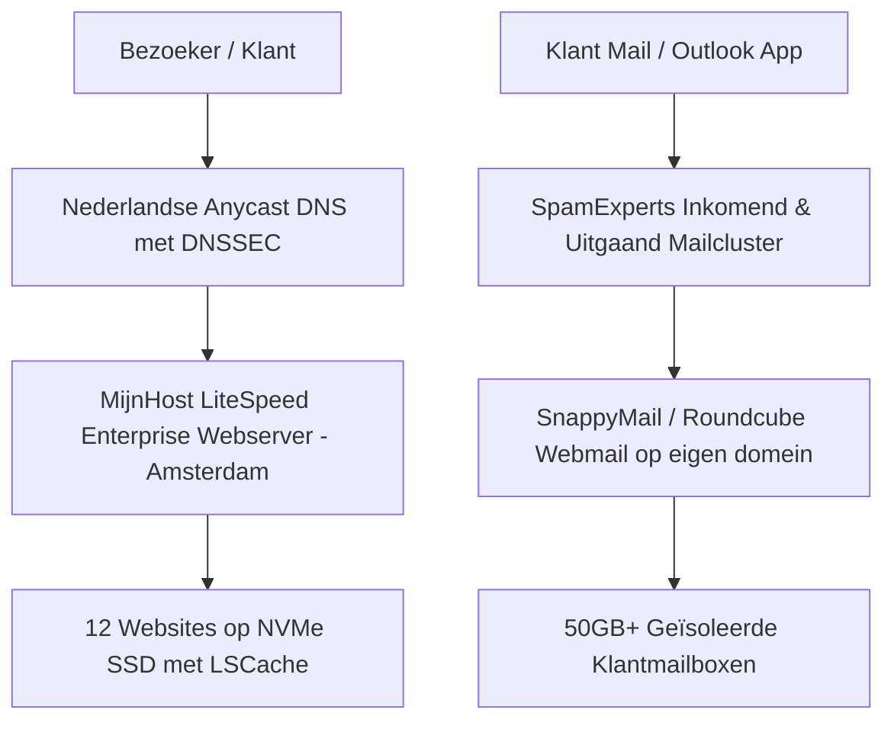
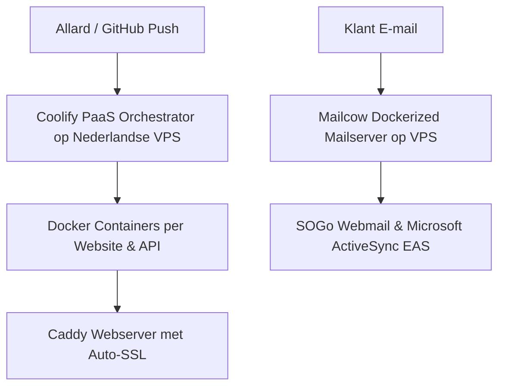

# 🇳🇱 100% Soeverein Cloud- & E-mail Migratieplan: De Nederlandse Enterprise Stack (TASK-504)

> **Documenttype**: Enterprise Cloud Architectuur & Data Souvereiniteits Handboek  
> **Portfolio**: 12 Actieve Productiedomeinen  
> **Doel**: 100% Onafhankelijk van Amerikaanse Big Tech (Zero Microsoft, Google, AWS)  
> **Jurisdictie**: 100% Nederlands Recht, AVG / GDPR Compliant, Nederlandse Datacenters  
> **Auteur**: Allard Veldman — Creation+Alt+Fix Lead DevOps

---

## 1. Waarom 100% Data Souvereiniteit? (De Strategische Meerwaarde)

Veel Nederlandse MKB'ers, zorgverleners, webshops en vaklieden hechten steeds meer waarde aan **digitale soevereiniteit**. Door de overstap te maken naar een puur Nederlandse infrastructuur realiseert Creation+Alt+Fix een uniek verkoopargument:

1. **Geen US CLOUD Act & FISA 702**: Amerikaanse wetgeving verplicht bedrijven zoals Microsoft, Google en AWS om klantdata af te staan aan Amerikaanse inlichtingendiensten, zélfs als de servers fysiek in Amsterdam of Ierland staan. Bij een 100% Nederlandse provider is dit wettelijk uitgesloten.
2. **100% Toezicht Autoriteit Persoonsgegevens (AP)**: Alle persoonsgegevens van jouw klanten en webshop-bezoekers blijven binnen Nederlandse landsgrenzen onder strikt EU-recht.
3. **Klimaatneutrale & Lokale Datacenters**: Draaiend op 100% Nederlandse wind- en zonne-energie (o.a. Equinix AM4 Science Park, NorthC Oude Meer en Digital Realty Amsterdam).
4. **Commercieel Verkoopargument (Unique Selling Point)**:
   > *"Jouw website en e-mail draaien bij Creation+Alt+Fix op 100% Nederlandse, klimaatneutrale servers met gegarandeerde privacy volgens de strengste Europese normen."*

---

## 2. De Nederlandse Kandidaten: Marktvergelijking

We hebben de Nederlandse top-providers onderzocht op schaalbaarheid, snelheid, mailkwaliteit en prijs:

| Provider | Hoofdkantoor & Datacenter | Webserver Technologie | E-mail Inlog & Spamfilter | Schaalbaarheid & Doelgroep |
| :--- | :--- | :--- | :--- | :--- |
| **MijnHost (Aanbevolen Managed)** | Amsterdam (Equinix AM4 / NorthC) | **LiteSpeed Enterprise** (HTTP/3, QUIC, LSCache) | **SpamExperts Cluster**, SnappyMail & Roundcube webmail + IMAP/Outlook | ⭐⭐⭐⭐⭐ Uitmuntend voor agencies met meerdere domeinen |
| **TransIP (team.blue)** | Delft / Amsterdam | Apache / Nginx / BladeVPS | E-mail Pro (SpamExperts), Roundcube + Outlook IMAP | ⭐⭐⭐⭐ Zeer betrouwbaar, maar prijzen zijn flink gestegen |
| **Soverin (Amsterdam)** | Amsterdam | N.v.t. (Puur E-mail) | Privacy-First Webmail + IMAP/CalDAV/CardDAV | ⭐⭐⭐⭐⭐ Beste privacy voor standalone e-mail (€ 39/jr) |
| **Leafcloud (Sovereign Cloud)** | Amsterdam (Circulaire restwarmte) | OpenStack Cloud VPS | Zelf beheren (bijv. Mailcow / Stalwart) | ⭐⭐⭐⭐ Enterprise cloud voor developer-teams |

---

## 3. Twee Soevereine Architectuur Scenario's

### Scenario 1: De "Managed Sovereign Agency" Stack (MijnHost Amsterdam)
*De snelste, meest stabiele en kostenefficiënte overstap zonder serverbeheer-kopzorgen.*

* **Webserver**: **LiteSpeed Enterprise** (tot 10x sneller dan de standaard Apache-servers van Vimexx). Ondersteunt native HTTP/3, QUIC en Redis/LSCache voor laadtijden onder de 50ms.
* **E-mail voor Klanten**:
  * Inbegrepen bij het pakket via het **SpamExperts Enterprise Cluster** (de gouden standaard in Nederland tegen spam en phishing).
  * Klanten loggen in via een moderne, snelle webmailinterface (**SnappyMail** of **Roundcube**) op hun eigen subdomein (bijv. `webmail.angelastenekes.nl`).
  * Volledige ondersteuning voor de **Microsoft Outlook App** en **Apple Mail** op smartphone en desktop via beveiligde IMAP/SMTP (SSL poorten 993/465).
* **Klant Inlogervaring**:
  * Elke klant krijgt een eigen e-mailadres met eigen geheim wachtwoord en optionele 2FA.
  * Geen afhankelijkheid van Microsoft-licenties.

#### Financiële Specificatie Scenario 1 (MijnHost):
* **Webhosting Zakelijk / Ultimate (Multi-domein, onbeperkt sites, NVMe)**: ~**€ 11,95 / maand** = **€ 143,40 / jaar**.
* **9× `.nl` Domeinregistratie**: € 5,75 per domein/jaar = **€ 51,75 / jaar**.
* **3× `.com` Domeinregistratie**: € 13,95 per domein/jaar = **€ 41,85 / jaar**.
* **Zakelijke E-mail (Onbeperkt mailboxen voor alle 12 domeinen)**: **€ 0,00 (Inbegrepen!)**.
* **TOTAAL JAARKOSTEN**: **€ 237,00 excl. btw / jaar (€ 286,77 incl. btw)**.
* *Vergelijking*: Goedkoper dan Vimexx Compleet (€ 272,76), maar op **LiteSpeed Enterprise** met **SpamExperts** en servers in Amsterdam!

---

### Scenario 2: De "Private Sovereign Cloud" (TransIP BladeVPS of Leafcloud + Coolify)
*Voor 100% autonomie, dedicated CPU-kernen en absolute isolatie van andere huurders.*

* **Infrastructuur**: Een eigen virtuele dedicated server in Amsterdam/Delft:
  * **TransIP BladeVPS PureSSD X4** (4 vCPU, 8 GB RAM, 250 GB NVMe opslag) à € 22,50/mnd, of
  * **Leafcloud VPS** (100% Nederlandse circulaire cloud).
* **GitOps Platform**: Installatie van **Coolify** (de open-source Europese tegenhanger van Azure Static Web Apps en Vercel):
  * Elke commit op GitHub triggert automatisch een deployment van de website op je eigen server.
  * Automatische Let's Encrypt Wildcard SSL certificaten.
  * Zero invloed van andere serverhuurders (100% dedicated resources).
* **E-mail Oplossing**:
  * **Optie A (Aanbevolen)**: Koppel de domeinen voor e-mail aan **MijnHost Mail** of **TransIP E-mail Only** (geen eigen mailserver onderhoud).
  * **Optie B (Full Sovereign Self-Hosted)**: Draai **Mailcow: dockerized** op de VPS. Dit biedt **SOGo Webmail** met native **Microsoft Exchange ActiveSync (EAS)**: klanten synchroniseren mail, agenda en contacten met Outlook alsof ze op een echte Microsoft Exchange-server zitten!

#### Financiële Specificatie Scenario 2 (Dedicated VPS):
* **VPS Server (4 vCPU, 8 GB RAM, 250 GB NVMe)**: € 20,00 / maand = **€ 240,00 / jaar**.
* **12 Domeinregistraties**: **€ 93,60 / jaar**.
* **TOTAAL JAARKOSTEN**: **~€ 333,60 excl. btw / jaar**.

---

## 4. Grote Vergelijking: Vimexx vs. Microsoft Azure vs. Nederlands Soeverein

| Criterium | 1. Huidig: Vimexx Compleet | 2. Microsoft Azure + M365 | 3. Nederlands Soeverein (MijnHost) | 4. Dedicated Sovereign (VPS + Coolify) |
| :--- | :--- | :--- | :--- | :--- |
| **Jurisdictie & Privacy** | NL (DirectAdmin) | ⚠️ US CLOUD Act (Microsoft) | 🇳🇱 **100% Nederlands Recht & AVG** | 🇳🇱 **100% Nederlands Recht & AVG** |
| **Datacenter Locatie** | Nederland (Vimexx cluster) | Amsterdam / Eemshaven | Amsterdam (Equinix AM4) | Delft / Amsterdam (TransIP / Leaf) |
| **Webserver Snelheid** | Traag (Apache shared) | Ultra-snel (Azure Edge CDN) | **Ultra-snel (LiteSpeed HTTP/3)** | **Ultra-snel (Caddy / Nginx NVMe)** |
| **E-mail Inlog Klanten** | Roundcube (Gedeeld IP) | `outlook.office365.com` | SnappyMail / Outlook IMAP | SOGo / Exchange ActiveSync |
| **Spamfilter Kwaliteit** | Matig (intern DirectAdmin) | Uitstekend (Microsoft Defender) | **Uitstekend (SpamExperts Cluster)** | Uitstekend (Rspamd / SpamExperts) |
| **GitOps CI/CD Koppeling** | FTP / FTPS Scripts | GitHub Actions native | Webhooks / Git push | **Coolify / Git push native** |
| **Kosten Webhosting / Server**| € 143,88 / jaar | € 0,00 (Free SWA) | € 143,40 / jaar | € 240,00 / jaar |
| **Kosten E-mail (12 domeinen)**| Inbegrepen | € 44,40 (Allard) + € 222,- (Klanten)| **€ 0,00 (Inbegrepen!)** | € 0,00 (Zelf gehost) |
| **Kosten 12 Domeinen** | € 128,88 / jaar | € 80,55 – € 128,88 / jaar | **€ 93,60 / jaar** | € 93,60 / jaar |
| **Totale Jaarkosten (excl. btw)**| **€ 272,76 / jaar** | **€ 125,- tot € 348,- / jaar** | **€ 237,00 / jaar** | **€ 333,60 / jaar** |

---

## 5. Klant E-mail Inlog in de Soevereine Stack

Wanneer we kiezen voor de Nederlandse soevereine route (Scenario 1 MijnHost):

1. **Hoe logt de klant in?**
   * **Webmail**: Klanten gaan naar `https://webmail.angelastenekes.nl` of `https://webmail.jouwdomein.nl`.
   * **Modern Design**: Ze loggen in op de moderne **SnappyMail** interface (clean, mobielvriendelijk, vergelijkbaar met Gmail/Outlook web).
2. **Koppeling met de Smartphone (iPhone / Android)**:
   * Klanten kunnen gewoon hun vertrouwde **Outlook App** of de ingebouwde **Apple Mail** app blijven gebruiken:
     * *Inkomende server*: `mail.jouwdomein.nl` (IMAP, Poort 993, SSL/TLS)
     * *Uitgaande server*: `mail.jouwdomein.nl` (SMTP, Poort 465, SSL/TLS)
3. **Het Verdienmodel blijft intact!**:
   * Omdat e-mail inbegrepen is bij MijnHost, kost het jou **€ 0,- extra** per klant.
   * Jij kunt nog steeds **€ 9,50 tot € 15,00 per maand** aan de klant factureren voor *"Beheerde Zakelijke E-mail, SpamExperts Beveiliging & Dagelijkse Back-ups"*.
   * **Resultaat**: 6 klanten (incl. F-Truck Store) à € 10/mnd = **€ 720,- / jaar pure winst** voor Creation+Alt+Fix!

---

## 6. Migratiestappen van Vimexx naar MijnHost

1. **Stap 1: Account & Domeinen Voorbereiden**:
   * Sluit het Multi-domein / Zakelijk pakket af bij MijnHost.
   * Vraag de verhuiscodes (EPP tokens) op in Vimexx DirectAdmin voor alle 12 domeinen.
2. **Stap 2: E-mail Synchronisatie via IMAP**:
   * Gebruik de ingebouwde gratis e-mail synchronisatietool van MijnHost (of `imapsync`).
   * Alle bestaande mappen, verzonden items en archieven worden 1-op-1 overgezet.
3. **Stap 3: Websites Overzetten**:
   * Upload de repositories en statische HTML5 websites.
   * Activeer de LiteSpeed caching regels in `.htaccess`.
4. **Stap 4: DNS Omzetten & Vimexx Opzeggen**:
   * Zodra de domeinen zijn verhuisd, genereren de gratis SSL-certificaten binnen 5 minuten.
   * Zeg het Vimexx hostingpakket (€ 143,88/jaar) formeel op.

---

## 7. Conclusie & Strategisch Besluit voor Allard

* **Als je het prestige van Microsoft en de officiële `outlook.office365.com` inlog wilt**: Kies voor **Azure + Microsoft 365** (uitgewerkt in [AZURE-MIGRATION-12-DOMAINS.md](file:///c:/Users/Admin/Documents/GitHub/Websites/Creation-Alt-Fix/docs/AZURE-MIGRATION-12-DOMAINS.md)).
* **Als je 100% Data Souvereiniteit, Nederlandse privacy en de snelste laadtijden wilt zonder Big Tech**: Kies voor **MijnHost Amsterdam (LiteSpeed Enterprise + SpamExperts)**. Het is **sneller dan Vimexx**, lost alle e-mail- en CDN-bottlenecks op, en kost je slechts **€ 237,- per jaar** inclusief álle 12 domeinen en onbeperkte mailboxen!
