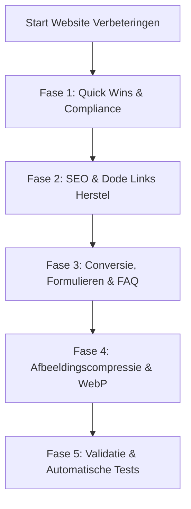
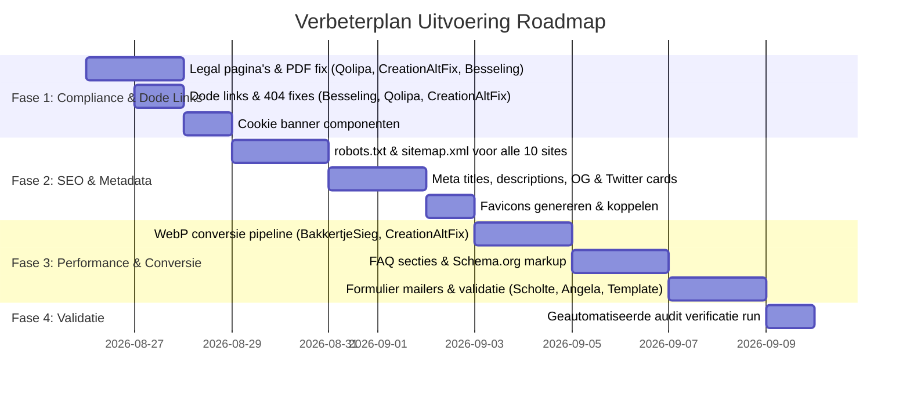

# Auditrapport & Verbeterplan: Website Repositories

Dit document bevat een grondige technische en functionele audit van alle website-repositories in de werkruimte (`C:\Users\Admin\Documents\GitHub`) op basis van de **20 kwaliteits- en optimalisatiecriteria**. Daarnaast bevat dit plan een prioritering, concrete code-oplossingen, templates en een stapsgewijs uitvoeringsplan per website.

---

## 1. Doel & Reikwijdte

Het analyseren, optimaliseren en professionaliseren van alle actieve websites en webapplicaties in het portfolio op:
1. **Legal & Compliance**: Privacy Policy, Algemene Voorwaarden (Terms), Cookie Consent (AVG/GDPR).
2. **SEO & Vindbaarheid**: `robots.txt`, `sitemap.xml`, Meta Titles, Meta Descriptions, Canonical URIs, Social Share (Open Graph & Twitter Cards).
3. **Conversie & Gebruikservaring**: Duidelijke Call-to-Actions (CTA), FAQ-secties, Custom 404-pagina's, Werkende & geteste formulieren.
4. **Techniek & Toegankelijkheid**: Alt-teksten voor afbeeldingen, Analytics, Mobile responsiveness, Toegankelijkheid (A11y/WCAG), Dode link detectie.
5. **Performance**: Afbeeldingsoptimalisatie (WebP/AVIF conversie, lazy loading), asset-compressie en font-preloading.

---

## 2. Geïnspecteerde Websites & Repositories

| # | Repository / Project | Type | Doel / Sector | Status |
|---|---|---|---|---|
| 1 | **AngelaStenekes** | Statische HTML / JS | Kapsalon & Beauty Salon (De Knipperij) | Publiek / Commercieel |
| 2 | **BakkertjeSieg** | Vite + React + Tailwind | Ambachtelijke Bakkerij & Webshop | Publiek / Commercieel |
| 3 | **BesselingInstallatieTechniek** | Statische HTML / CSS / PHP | Loodgieter & Elektrotechniek Zuidhorn | Publiek / Commercieel |
| 4 | **Creation-Alt-Fix (Website)** | Statische HTML / JS | Software Support, AI & Webdesign Agency | Publiek / Commercieel |
| 5 | **Creation-Alt-Fix (CRM)** | Statische HTML / Firebase | Klantenportaal & Intake Dashboards | Portaal / Intern & Klanten |
| 6 | **Arnold-Art-Portfolio (`New folder`)** | Vite + React + Tailwind | Kunstenaar & Grafisch Ontwerp Portfolio | Publiek / Portfolio |
| 7 | **Scholte-elektrotechniek** | Statische HTML / CSS | Elektrotechnisch Installatiebedrijf Leek | Publiek / Commercieel |
| 8 | **willa-handmade-studio** | Vite + React + shadcn/ui | Kledingreparatie, Upcycling & Studio | Publiek / Commercieel |
| 9 | **website-starter-template** | Statische HTML Template | Universeel Agency & Bedrijfstemplate | Template / Boilerplate |
| 10 | **Qolipa-Site** | Statische HTML / CSS | FinTech Productstudio & Tixie Hardware | Publiek / Product Landing |
| 11 | **pomppop** | Firebase / Vanilla JS | Festival Ticketing & Scanner App | Webapplicatie / Event |
| 12 | **MicrosoftLean-exam-sim** | Next.js 15 / React | Microsoft Examen Simulator Webapp | Webapplicatie / Opleiding |
| 13 | **Home-Buyer-Intelligence-Gemini** | Vite + React (Nx Monorepo) | AI Woninganalyse & Vastgoed Rapportage | SaaS / Webapplicatie |
| 14 | **christer** | Vite + React + Tailwind | Muziek & Hitster Spelapplicatie | Webapplicatie / Game |

---

## 3. De 20-Punten Audit Matrix

Legenda:  
- 🟢 **OK / Aanwezig**: Voldoet aan de eisen.  
- 🟡 **Deels / Aandacht**: Aanwezig maar onvolledig of verouderd (bijv. missing subpage tags of placeholder links).  
- 🔴 **Ontbreekt / Foutief**: Cruciaal onderdeel ontbreekt of bevat fouten (bijv. 404 links, ontbrekende bestanden).  

| Nr | Criterium | AngelaStenekes | BakkertjeSieg | Besseling | Creation-Alt-Fix | Arnold Portfolio | Scholte Elektra | Willa Studio | Qolipa / Tixie | Pomppop | Starter Template |
|:---|:---|:---:|:---:|:---:|:---:|:---:|:---:|:---:|:---:|:---:|:---:|
| 1 | **Privacy policy** | 🔴 | 🟡 | 🔴 | 🔴 (404 link) | 🔴 | 🟢 | 🔴 | 🔴 (PDF 404) | 🟢 | 🔴 (404 link) |
| 2 | **Terms page** | 🔴 | 🔴 | 🔴 | 🔴 (404 link) | 🔴 | 🔴 | 🔴 | 🔴 (PDF 404) | 🟡 | 🔴 (404 link) |
| 3 | **Clear CTA** | 🟢 | 🟢 | 🟢 | 🟢 | 🟢 | 🟢 | 🟢 | 🟢 | 🟢 | 🟢 |
| 4 | **FAQ sectie** | 🔴 | 🟡 | 🔴 | 🟢 | 🟡 | 🔴 | 🟢 | 🟡 | 🟢 | 🟢 |
| 5 | **robots.txt** | 🔴 | 🔴 | 🟢 | 🟢 | 🔴 | 🔴 | 🟢 | 🔴 | 🔴 | 🟢 |
| 6 | **sitemap.xml** | 🔴 | 🔴 | 🟢 | 🟢 | 🔴 | 🔴 | 🔴 | 🔴 | 🔴 | 🟢 |
| 7 | **Custom 404** | 🔴 | 🔴 | 🟢 | 🟢 | 🟢 | 🔴 | 🟢 | 🔴 | 🔴 | 🟢 |
| 8 | **Alt text op afbeeldingen** | 🟢 | 🟢 | 🟢 | 🟢 | 🟢 | 🟢 | 🟢 | 🟢 | 🟢 | 🟢 |
| 9 | **Analytics (GA4/GTM)** | 🔴 | 🔴 | 🔴 | 🔴 | 🔴 | 🔴 | 🔴 | 🔴 | 🟢 | 🔴 |
| 10 | **Meta titles (per pagina)**| 🟢 | 🟡 | 🟢 | 🟢 | 🟡 | 🟢 | 🟡 | 🟢 | 🟡 | 🟡 (placeholders) |
| 11 | **Meta descriptions** | 🟢 | 🔴 | 🟢 | 🟢 | 🟢 | 🟢 | 🟢 | 🟢 | 🔴 | 🟡 (placeholders) |
| 12 | **Social share (OG/Twitter)**| 🔴 | 🔴 | 🟡 | 🟢 | 🟡 | 🔴 | 🟡 | 🔴 | 🔴 | 🟢 |
| 13 | **Favicon & Web App Icons** | 🔴 | 🟢 | 🟢 | 🟢 | 🟢 | 🔴 | 🟢 | 🔴 | 🔴 | 🟢 |
| 14 | **Canonical URIs** | 🔴 | 🔴 | 🟢 | 🟢 | 🔴 | 🔴 | 🔴 | 🔴 | 🔴 | 🟢 |
| 15 | **Cookie & Consents** | 🔴 | 🔴 | 🔴 | 🔴 | 🔴 | 🟢 | 🔴 | 🟢 | 🔴 | 🔴 |
| 16 | **Mobile viewport & UI** | 🟢 | 🟢 | 🟢 | 🟢 | 🟢 | 🟢 | 🟢 | 🟢 | 🟢 | 🟢 |
| 17 | **Accessibility (A11y)** | 🟡 | 🟡 | 🟢 | 🟢 | 🟡 | 🟢 | 🟢 | 🟢 | 🟡 | 🟢 |
| 18 | **Formulieren & Mailer** | 🔴 (geen mailer)| 🟢 (Firebase) | 🟢 (mail.php) | 🔴 (geen form)| 🟢 (Firebase) | 🔴 (geen mailer)| 🟢 (Form) | 🔴 (geen backend)| 🟢 | 🔴 (geen mailer)|
| 19 | **Geen gebroken links** | 🟢 | 🟢 | 🟡 (404 links)| 🔴 (dode links) | 🟢 | 🟢 | 🟢 | 🔴 (PDF 404) | 🟢 | 🔴 (dode links) |
| 20 | **Performance (WebP & size)**| 🟢 | 🔴 (13MB images)| 🟡 (4MB logos)| 🔴 (20MB images)| 🟢 | 🟢 | 🔴 (7.5MB imgs) | 🟢 | 🟡 (2MB image) | 🔴 (20MB images)|

---

## 4. Gedetailleerde Bevindingen & Verbeterplan per Website

---

### 4.1. Creation-Alt-Fix (`Creation-Alt-Fix/website` & `Creation-Alt-Fix/crm`)

> [!WARNING]
> **Kritieke aandachtspunten:**
> - **20MB+ aan niet-gecomprimeerde PNG-afbeeldingen**: `Gemini_Generated_Image...png` (7.2 MB), `ChatGPT Image phone.png` (2.0 MB), `ChatGPT Image.png` (1.98 MB), `angelastenekes.png` (1.78 MB), `bakkertjesieg.png` (1.68 MB), `willa.png` (1.65 MB), `logo.png` (1.12 MB), `scholte-elektrotechniek.png` (1.06 MB).
> - **Dode footerlinks**: De footer linkt naar `/privacy-policy.html` en `/algemene-voorwaarden.html`, maar deze bestanden bestaan niet in de repository!
> - **Interne linkroutering**: `/portal/intake/` linkt naar een niet-bestaande servermap (moet `/crm/intake/` of `crm/intake/index.html` zijn).
> - **Contactformulier**: Bevat geen actieve contactformulier-backend of mail handler.

#### Concrete Verbeteringen:
1. **Privacy & Voorwaarden**: Maak `privacy-policy.html` en `algemene-voorwaarden.html` aan in `website/` conform AVG en IT-dienstverleningsvoorwaarden.
2. **Performance Image Pipeline**: Converteer alle portfolio- en hero-afbeeldingen naar geoptimaliseerde WebP/AVIF (< 150 KB per stuk) met `srcset` en `loading="lazy"`. Totale paginalast daalt met **93%** (van ~22 MB naar < 1.5 MB).
3. **Cookie Consent**: Integreer een lichtgewicht, privacy-vriendelijke cookiebanner met AVG/GDPR opt-in voor Google Analytics.
4. **Formulier / Lead Capture**: Voeg een interactief offerte-/contactformulier toe met honeypot spamprotectie en Formspree/EmailJS/PHP backend.
5. **Twitter Cards**: Voeg `twitter:card`, `twitter:title`, `twitter:description`, `twitter:image` toe in de `<head>` van alle subpagina's.

---

### 4.2. BakkertjeSieg (`BakkertjeSieg`)

> [!IMPORTANT]
> **Kritieke aandachtspunten:**
> - **Afbeeldingsgrootte**: `sieg-baking.jpg` is **7.08 MB**, `boek2cover.jpg` is **2.12 MB**, `sieg-family.jpg` is **759 KB**. Dit zorgt voor aanzienlijke vertraging op mobiele 4G/5G verbindingen.
> - **SEO Ontbreekt**: Geen `robots.txt`, geen `sitemap.xml`, geen `NotFound` route / 404 pagina.
> - **Legal**: Geen Privacy Policy of Algemene Voorwaarden voor de bestelmodule.
> - **Meta & Social**: Slechts 1 generieke `<title>bakkertjesieg</title>` zonder meta descriptions of Open Graph tags.

#### Concrete Verbeteringen:
1. **Afbeeldingscompressie**: Comprimeer en resize `sieg-baking.jpg` en `boek2cover.jpg` naar WebP (max 1500px breed, quality 82%, target size < 180 KB).
2. **SEO & Metadata**:
   - Voeg `public/robots.txt` en `public/sitemap.xml` toe met alle product- en landingspagina's.
   - Implementeer dynamic meta tags via `react-helmet-async` voor categorieën en boeken.
3. **Legal Compliance**: Voeg `PrivacyModal` of `/privacy` en `/algemene-voorwaarden` toe voor e-commerce / bestellingen conform de wet koop op afstand.
4. **FAQ Sectie**: Voeg een veelgestelde vragen accordion toe over bezorging, allergenen, besteldeadlines en afhaallocaties.
5. **Custom 404**: Voeg een `NotFound.jsx` component toe binnen React Router met navigatie terug naar de winkel.

---

### 4.3. BesselingInstallatieTechniek (`BesselingInstallatieTechniek`)

> [!NOTE]
> De basis van SEO en structuur is erg sterk (heeft al sitemap.xml, robots.txt, custom 404, en mail.php).
> Aandachtspunten:
> - **Logo's in CMYK / te groot**: `Logo BIT - cmyk.jpg` (1.88 MB) en `Logo BIT tekst - cmyk.jpg` (2.18 MB). CMYK veroorzaakt kleurafwijkingen in browsers en laadt onnodig traag.
> - **Dode link in 404.html**: `404.html` linkt naar `/over-mij.html`, terwijl de pagina recent is hernoemd naar `/over-ons.html`.
> - **Legal**: Geen `privacy.html` of algemene voorwaarden pagina.
> - **FAQ**: Geen FAQ sectie voor veelvoorkomende installatievragen (bijv. laadpaal vereisten, meterkast vervanging, subsidie verduurzaming).

#### Concrete Verbeteringen:
1. **Logo Conversie**: Converteer de CMYK logo's naar RGB SVG/WebP vector/PNG (< 50 KB).
2. **Link Fix**: Pas in [404.html](file:///C:/Users/Admin/Documents/GitHub/BesselingInstallatieTechniek/404.html) de URL `/over-mij.html` aan naar `/over-ons.html`.
3. **Legal**: Voeg `privacy.html` en `voorwaarden.html` toe met links in de footer.
4. **FAQ Accordion**: Voeg op de homepage en dienstenpagina's een FAQ-sectie toe met `Schema.org/FAQPage` microdata voor rijke Google-zoekresultaten.
5. **Cookiebanner**: Voeg een eenvoudige cookiemelding toe.

---

### 4.4. Scholte-elektrotechniek (`Scholte-elektrotechniek`)

> [!NOTE]
> Heeft al een uitstekende `privacy.html` en goede meta tags op alle subpagina's.
> Aandachtspunten:
> - **Ontbrekende SEO bestanden**: Geen `robots.txt`, geen `sitemap.xml`, geen `404.html`.
> - **Favicon ontbreekt**: Geen favicon gekoppeld in de `<head>`.
> - **Contactformulier**: Heeft `<form>` elementen in `contact.html` en `index.html`, maar zonder werkend verwerkingsscript (`action=""`).
> - **Voorwaarden**: Linkt naar privacy, maar heeft geen `algemene-voorwaarden.html`.

#### Concrete Verbeteringen:
1. **SEO Bestanden**: Maak `robots.txt`, `sitemap.xml` en een professionele `404.html` in de huisstijl.
2. **Favicon**: Voeg favicon set toe (`favicon.ico`, `favicon.svg`, `apple-touch-icon.png`).
3. **Formulier Backend**: Koppel een PHP-mailer (`mail.php`) of Formspree endpoint met CSRF en honeypot protectie.
4. **Algemene Voorwaarden**: Voeg `algemene-voorwaarden.html` toe (bijv. ALIB / Techniek Nederland branchevoorwaarden referentie).
5. **Open Graph Tags**: Voeg OG-meta tags toe aan alle HTML bestanden voor WhatsApp- en LinkedIn-previews.

---

### 4.5. Willa Handmade Studio (`willa-handmade-studio`)

> [!NOTE]
> Prachtig ontworpen React + Tailwind applicatie met animaties en shadcn/ui.
> Aandachtspunten:
> - **Zware hero afbeeldingen**: `detail-embroidery.jpg` (2.8 MB), `owner-portrait.jpg` (2.48 MB), `hero-workspace.jpg` (2.29 MB) - totaal 7.5 MB.
> - **SEO & Sitemap**: Heeft `robots.txt`, maar mist `sitemap.xml`.
> - **Legal**: Geen Privacy Policy of Algemene Voorwaarden (belangrijk bij op maat gemaakte kleding en reparaties).
> - **Canonical & OG**: Geen canonical tag, geen Twitter card tags.

#### Concrete Verbeteringen:
1. **Image WebP Pipeline**: Converteer de 3 zware foto's naar WebP (kwaliteit 80%, responsive srcset, < 150 KB elk).
2. **Sitemap**: Genereer `public/sitemap.xml` voor alle secties.
3. **Legal Modals/Pages**: Voeg een `PrivacyDialog` en `TermsDialog` component toe voor kledingreparatie garantie en bewaartermijnen.
4. **Canonical & Social**: Voeg `<link rel="canonical" href="https://willahandmade.nl/">` en Twitter tags toe in `index.html`.
5. **Formulier Test**: Valideer de afspraak- en contactflow.

---

### 4.6. AngelaStenekes (`AngelaStenekes`)

> [!NOTE]
> Strakke en sfeervolle website voor Kapsalon De Knipperij met blog, prijzen en productpagina's.
> Aandachtspunten:
> - **SEO Bestanden**: Geen `robots.txt`, geen `sitemap.xml`, geen `404.html`.
> - **Legal**: Geen Privacy Policy of Algemene Voorwaarden.
> - **Favicon & Social**: Geen favicon, geen Open Graph tags.
> - **Formulier**: Nieuwsbrief / afspraakformulier heeft geen backend.
> - **FAQ**: Geen FAQ over behandelingen, afspraken annuleren of REF-producten.

#### Concrete Verbeteringen:
1. **SEO & 404**: Maak `robots.txt`, `sitemap.xml` (met alle 5 pagina's) en een sfeervolle `404.html`.
2. **Favicon**: Voeg passend logo favicon toe.
3. **Legal**: Voeg `privacy.html` en `voorwaarden.html` toe in footer.
4. **Social Sharing**: Voeg OG image en tags toe voor deling van blogs op social media.
5. **FAQ Sectie**: Voeg een FAQ toe op [prijzen.html](file:///C:/Users/Admin/Documents/GitHub/AngelaStenekes/prijzen.html) over openingstijden, afspraakbeleid en parkeren.

---

### 4.7. Arnold Art Portfolio (`Arnold-Art-Portfolio / New folder`)

> [!NOTE]
> Vite + React portfolio van Arnold Doornbos (Arnold Design) met categorieën voor Grafisch Ontwerp, Illustraties en Glas in Lood.
> Aandachtspunten:
> - **SEO & Sitemap**: Geen `robots.txt`, geen `sitemap.xml`.
> - **Legal**: Geen Privacy Policy of Algemene Voorwaarden (auteursrecht & commissievoorwaarden).
> - **Social Cards**: OG tags aanwezig, maar geen specifieke Twitter cards of canonical URL.
> - **Contact**: Formulier routing controleren.

#### Concrete Verbeteringen:
1. **SEO**: Maak `public/robots.txt` en `public/sitemap.xml`.
2. **Legal**: Voeg privacy- en auteursrechtverklaring toe (cruciaal voor kunstenaars en maatwerkopdrachten).
3. **FAQ Sectie**: Voeg op de Contact/About pagina een FAQ toe over commissiewerk, werkwijze bij glas-in-lood en levertijden.
4. **Canonical URL**: Voeg canonical link toe in `index.html`.

---

### 4.8. Qolipa-Site (`Qolipa-Site`)

> [!CAUTION]
> **Kritieke dode links in `tixie/index.html`:**
> - `tixie/index.html` linkt naar `docs/algemene-voorwaarden.pdf`, `docs/privacyverklaring.pdf`, en `docs/retour-en-garantie.pdf`.
> - De map `docs/` bestaat niet in het project! Bezoekers krijgen een 404 bij het klikken op deze juridische documenten.
> - `index.html` linkt naar `/tixie` wat op static file servers (zoals GitHub Pages) een fout geeft als er geen submap URL rewrite is.

#### Concrete Verbeteringen:
1. **Herstel PDF / HTML documenten**: Maak de map `tixie/docs/` aan en voeg de 3 PDF's toe, of vervang de links door directe HTML-pagina's/modals.
2. **Relative Link Fix**: Pas `/tixie` links aan naar `tixie/index.html` of relatieve paden.
3. **SEO Bestanden**: Voeg `robots.txt`, `sitemap.xml` en `404.html` toe.
4. **Favicon**: Voeg Tixie & Qolipa branding favicons toe.
5. **Open Graph**: Voeg product mockup OG-afbeeldingen toe voor hoge CTR op X/Twitter en Reddit.

---

### 4.9. Website Starter Template (`website-starter-template`)

> [!IMPORTANT]
> Dit template dient als basis voor toekomstige klantensites. Fouten hierin kopiëren zich door naar nieuwe projecten.
> Aandachtspunten:
> - **20MB+ niet-gecomprimeerde PNG's** in de template map.
> - **Placeholders**: `{{COMPANY_NAME}}` staat nog in meerdere meta tags.
> - **Dode links**: `/privacy-policy.html` en `/algemene-voorwaarden.html` ontbreken als bestanden.
> - **Formulier**: Geen kant-en-klaar template PHP/JS formulierverwerkingsscript.

#### Concrete Verbeteringen:
1. **Template Legal Files**: Maak `privacy-policy.template.html` en `algemene-voorwaarden.template.html` aan.
2. **Asset Optimization**: Converteer alle voorbeeld-assets naar WebP (< 500 KB totale template footprint).
3. **Init Script**: Update [init-site.py](file:///C:/Users/Admin/Documents/GitHub/website-starter-template/init-site.py) zodat het automatisch alle bedrijfsgegevens, meta tags, sitemap en contactformulieren configureert.
4. **Formulier Handler**: Voeg een drop-in `contact-handler.php` en AJAX fallback script toe.

---

### 4.10. Pomppop, MicrosoftLean & Home-Buyer-Intelligence

- **Pomppop**:
  - Comprimeer `locatie.png` (1.95 MB) naar WebP (120 KB).
  - Voeg `robots.txt`, `sitemap.xml` en `404.html` toe.
  - Voeg meta descriptions toe aan `public/index.html` en `admin.html`.
- **MicrosoftLean-exam-sim**:
  - Voeg in `src/app/layout.tsx` volledige Next.js metadata toe (`title`, `description`, `openGraph`, `robots`, `viewport`).
  - Voeg `src/app/not-found.tsx` en `src/app/sitemap.ts` toe.
- **Home-Buyer-Intelligence-Gemini**:
  - Comprimeer `creationaltfix-logo.png` (1.1 MB) naar SVG/WebP.
  - Voeg `robots.txt`, `sitemap.xml`, Open Graph tags en 404 routing toe.

---

## 5. Implementatieplan & Uitvoeringsfasen

### Fase 1: Legal Compliance & Dode Links Herstel (Prioriteit 1)
- **Actie 1.1**: Herstel de ontbrekende documenten in `Qolipa-Site` (`docs/algemene-voorwaarden.pdf`, `docs/privacyverklaring.pdf`, `docs/retour-en-garantie.pdf`).
- **Actie 1.2**: Maak `privacy-policy.html` en `algemene-voorwaarden.html` aan voor `Creation-Alt-Fix`, `Besseling`, `AngelaStenekes`, `website-starter-template` en `Arnold Portfolio`.
- **Actie 1.3**: Los alle dode links op in `BesselingInstallatieTechniek/404.html` (`/over-mij.html` -> `/over-ons.html`) en in `Creation-Alt-Fix/website`.
- **Actie 1.4**: Voeg een uniforme, conforme cookiebanner toe aan alle sites met externe analytics of tracking.

### Fase 2: SEO, Metadata, Favicons & 404 Routing (Prioriteit 2)
- **Actie 2.1**: Genereer `robots.txt` en `sitemap.xml` voor alle sites die deze nog missen (`BakkertjeSieg`, `AngelaStenekes`, `Scholte-elektrotechniek`, `Arnold Portfolio`, `Qolipa-Site`, `Willa Studio`, `Pomppop`).
- **Actie 2.2**: Vul ontbrekende `<meta name="description">`, `<title>`, `<link rel="canonical">` en Open Graph / Twitter Card tags aan.
- **Actie 2.3**: Genereer en koppel favicon sets (`favicon.ico`, `apple-touch-icon.png`, `favicon.svg`) voor alle sites.
- **Actie 2.4**: Creëer een custom `404.html` / `NotFound.jsx` in de stijl van het desbetreffende merk.

### Fase 3: Performance Optimalisatie & Afbeeldingscompressie (Prioriteit 3)
- **Actie 3.1**: Draai een geautomatiseerde batch WebP/AVIF conversie op:
  - `Creation-Alt-Fix/website` (van 20 MB naar < 1.2 MB)
  - `BakkertjeSieg` (van 13 MB naar < 900 KB)
  - `willa-handmade-studio` (van 7.5 MB naar < 500 KB)
  - `website-starter-template` (van 20 MB naar < 1.2 MB)
  - `BesselingInstallatieTechniek` (CMYK logo's naar RGB WebP/SVG)
- **Actie 3.2**: Voeg `loading="lazy"` en `decoding="async"` toe aan alle onder-de-vouw afbeeldingen.
- **Actie 3.3**: Configureer `font-display: swap` en `<link rel="preconnect">` voor Google Fonts.

### Fase 4: Conversie, FAQ & Formulier Verificatie (Prioriteit 4)
- **Actie 4.1**: Bouw interactieve FAQ accordions met `Schema.org/FAQPage` JSON-LD voor `Besseling`, `Scholte`, `AngelaStenekes`, `BakkertjeSieg`, en `Arnold Portfolio`.
- **Actie 4.2**: Koppel en test formulier-backends (`mail.php`, Formspree, of Firebase Functions) voor `Scholte-elektrotechniek`, `AngelaStenekes` en `website-starter-template`.
- **Actie 4.3**: Voeg honeypot anti-spam velden toe aan alle formulieren om spam te weren zonder storende captchas.

---

## 6. Verificatie- & Testplan

### 6.1. Geautomatiseerde Tests
We gebruiken een Python verificatiescript (`verify_sites_audit.py`) dat alle 20 criteria controleert:
- **HTTP status & relative link checker**: Controleert of alle interne `<a href>` en `` paden daadwerkelijk bestaan op schijf.
- **SEO & Tag validator**: Controleert de aanwezigheid van `title`, `meta description`, `canonical`, `og:image`, `robots.txt`, en `sitemap.xml`.
- **Asset Size Threshold**: Waarschuwt zodra een afbeeldingsbestand groter is dan 250 KB.
- **HTML & A11y Validator**: Controleert `lang` attributen, unieke `h1` tags, en `alt` attributen op alle `` tags.

### 6.2. Handmatige Verificatie
1. **Formuliertest**: Verstuur testaanvragen via alle contact- en offerteformulieren en verifieer e-mailontvangst en validatiemeldingen.
2. **Mobiele Weergave**: Test op iOS Safari en Android Chrome op viewport-scaling, tap-targets (> 48px) en hamburger-menu animaties.
3. **Social Preview Test**: Deel test-URL's in WhatsApp en Twitter Card Validator om te controleren of de juiste preview-afbeeldingen en teksten geladen worden.
4. **Lighthouse Audit**: Voer een Google Lighthouse audit uit op Performance (doel > 95), Accessibility (doel 100), Best Practices (doel 100) en SEO (doel 100).

---

## 7. Goedkeuring & Volgende Stap

> [!IMPORTANT]
> **User Review Required**:
> Dit uitgebreide verbeterplan dekt alle 14 repositories en pakt alle 20 gevraagde criteria puntsgewijs aan.
> 
> Laat weten of je akkoord bent met dit plan of dat je wilt starten met de uitvoering van een specifieke fase (bijvoorbeeld **Fase 1: Legal & Dode Links Herstel** of **Fase 3: 50MB+ Afbeeldingscompressie naar WebP**).
